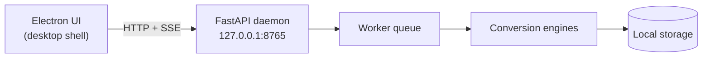

<p align="center">
  
</p>

<p align="center">
  <strong>An offline, privacy-first desktop toolkit for documents, images, eBooks, and archives.</strong>
</p>

<p align="center">
  <a href="https://github.com/NomanRafique01/ToolCEO/releases/latest">
    
  </a>
  
  
  
  
  
  
</p>

ToolCEO converts, compresses, and transforms files entirely on your own machine. There are no uploads, no cloud services, and no telemetry. Your files never leave your computer.

## Download

<p align="center">
  <a href="https://github.com/NomanRafique01/ToolCEO/releases/latest/download/ToolCEO.Setup.1.0.0.exe">
    
  </a>
  <a href="https://github.com/NomanRafique01/ToolCEO/releases/latest">
    
  </a>
</p>

The latest version is always available on the [releases page](https://github.com/NomanRafique01/ToolCEO/releases/latest). The Windows installer (`ToolCEO.Setup.*.exe`, ~206 MB) includes the full app with all 172 tools; optional conversion engines download on demand from inside the app.

## Table of Contents

- [Features](#features)
- [Installation](#installation)
- [Tool Catalog](#tool-catalog)
- [Modular Engines](#modular-engines)
- [Architecture](#architecture)
- [Development](#development)
- [Local API](#local-api)
- [Roadmap](#roadmap)
- [License](#license)

## Features

- **172 offline tools** covering PDF, Office, image, eBook, and archive workflows
- **Fully local processing**: source files and outputs stay on your workstation
- **Live progress**: Server-Sent Events stream frame-accurate progress to the interface
- **Background job queue**: conversions run in a worker pool, so the UI stays responsive during batch jobs
- **On-demand engines**: heavy processing modules install only when needed, keeping the base installer around 206 MB

## Installation

Pre-built packages are available for 64-bit Windows.

| Package | Description | Download |
|---|---|---|
| **Installer** (`.exe`) | Setup wizard with Start Menu entry, desktop shortcut, and uninstaller | [Download](https://github.com/NomanRafique01/ToolCEO/releases/latest/download/ToolCEO.Setup.1.0.0.exe) |

### System Requirements

| Component | Minimum | Recommended |
|---|---|---|
| OS | Windows 10 (x64) | Windows 11 (x64) |
| Processor | Intel Core i3 / AMD Ryzen 3 | Any modern quad-core |
| Memory | 4 GB RAM | 8 GB RAM for large batches |
| Storage | 1 GB free | 3 GB free with all optional modules |
| Network | Not required | Not required |

## Tool Catalog

| Category | Tools | Breakdown |
|---|:---:|---|
| **Documents** | 55 | PDF Tools (8), PDF Conversions (7), Word (6), Excel (6), PowerPoint (6), Text (7), OpenDocument (7), CSV (8) |
| **Images** | 27 | JPG (8), PNG (7), WebP (7), SVG (4), Smart Compressor (1) |
| **eBooks** | 42 | PDF, EPUB, MOBI, AZW3, FB2, TXT, RTF — 6 tools each |
| **Archives** | 48 | Create (10), Extract (12), ZIP / TAR / 7Z / TAR.GZ / RAR convert (4 each), Utilities (6) |
| **Total available** | **172** | |

**Coming soon:** Audio conversions (MP3, WAV, FLAC, AAC, OGG, WMA, M4A, OPUS), Video tools, and Data conversions.

## Modular Engines

Heavy processing engines are downloaded from the in-app **Modules** panel and cached locally for offline use.

| Module | Purpose | Download size |
|---|---|---|
| **Office** | Advanced DOC/DOCX, XLS/XLSX, and PPT/PPTX conversion | ~318 MB |
| **OCR** | Text recognition for scanned PDFs and images | ~46 MB |
| **Document** | Pandoc-based Markdown, LaTeX, RTF, and EPUB compilation | ~43 MB |
| **eBook** | Calibre-based eBook transformation | ~281 MB |
| **Media** | Audio and video transcoding (coming soon) | ~43 MB |

## Architecture



- **Frontend:** Electron 43 provides the native window, dark-mode interface, and a secure context bridge to the OS.
- **Backend:** A local FastAPI service bound to `127.0.0.1` manages the worker queue and runs every conversion offline.
- **Progress:** A persistent SSE connection streams job progress from 0% to 100%.

## Development

### Prerequisites

- Node.js 18.0 or later
- Python 3.10 or later
- npm and pip

### Setup

```bash
# Clone and install frontend dependencies
git clone https://github.com/NomanRafique01/ToolCEO.git
cd ToolCEO
npm install

# Set up the Python backend
cd backend
python -m venv venv
source venv/bin/activate        # Windows: .\venv\Scripts\activate
pip install -r requirements.txt
cd ..

# Launch the app
npm start
```

## Local API

The backend exposes the following endpoints on `http://127.0.0.1:8765`. Long-running operations return a `job_id`, which you can poll through the progress stream and then download.

| Endpoint | Method | Input | Output |
|---|---|---|---|
| `/health` | `GET` | None | `{ "status": "ok" }` |
| `/api/pdf/merger/merge` | `POST` | `files: UploadFile[]` | `{ "job_id": "<uuid>" }` |
| `/api/pdf/split` | `POST` | `file: UploadFile`, `ranges: string` | `{ "job_id": "<uuid>" }` |
| `/api/pdf/compress` | `POST` | `file: UploadFile`, `quality: string` | `{ "job_id": "<uuid>" }` |
| `/api/progress/{job_id}` | `GET` | `job_id` (path) | `text/event-stream` |
| `/api/download/{job_id}` | `GET` | `job_id` (path) | Binary file stream |

## Roadmap

| Phase | Milestone | Status |
|---|---|---|
| 1 | Core architecture: Electron shell, FastAPI daemon, SSE progress, base UI | ✅ Completed |
| 2 | Professional PDF suite: split, merge, compress, rotate, encrypt/decrypt, OCR | ✅ Completed |
| 3 | Document and Office conversions: PDF, Word, Excel, PowerPoint, HTML, text | ✅ Completed |
| 4 | Image tools: multi-format conversion, batch compression, resizing | ✅ Completed |
| 5 | On-demand modular engine runtime: download, extraction, and caching | ✅ Completed |
| 6 | Audio, video, and data tools | 🚧 Coming soon |

## Feedback

Found a bug or have a feature request? Please open an issue on the [GitHub repository](https://github.com/NomanRafique01/ToolCEO/issues).

## License

ToolCEO is released under the MIT License. See [LICENSE](LICENSE) for details.

---

<p align="center">
  <sub>Built by <a href="https://github.com/NomanRafique01">Noman Rafique</a></sub>
</p>
