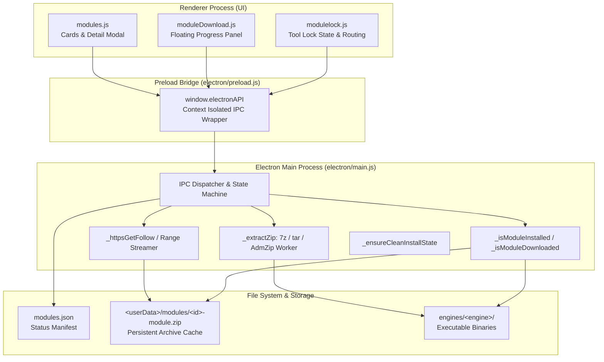
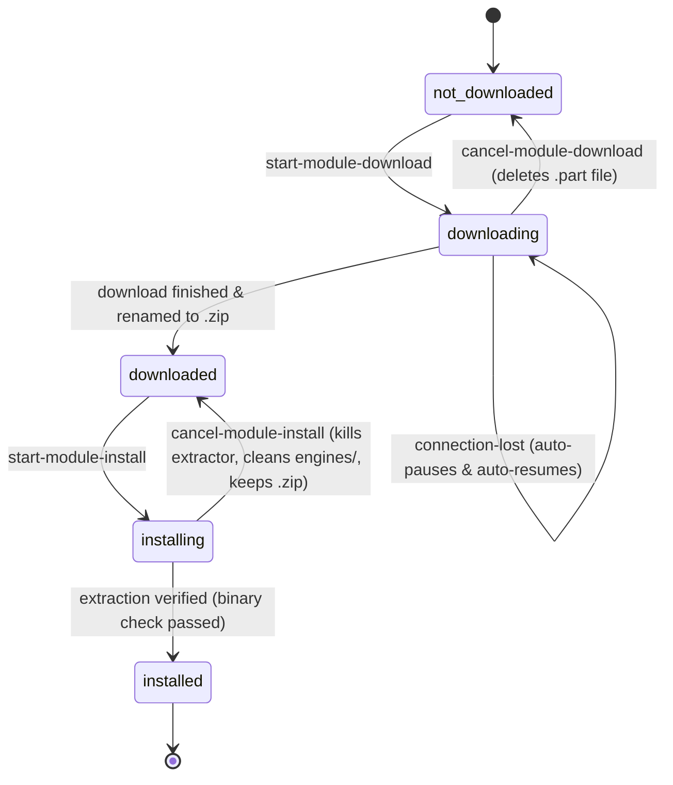

# ToolCEO Engine Module System: Architecture & Extension Guide

> **Document Version**: 2.0  
> **Target Audience**: AI Coding Assistants, Lead Engineers, System Architects  
> **Applies to**: ToolCEO Desktop (Electron + Vanilla JS + Python Backend)

---

## 1. Executive Summary

ToolCEO uses an on-demand engine architecture to keep its initial installer lightweight (~45 MB). Heavy third-party conversion binaries (LibreOffice, Tesseract, Pandoc, Calibre, FFmpeg, 7-Zip) are modularized into separate packages.

The system features a **two-step lifecycle**:
1. **Download Phase**: Downloads the engine archive `.zip` from GitHub Releases into persistent user data storage (`app.getPath('userData')/modules/`).
2. **Install Phase**: Extracts the engine binaries into `engines/<engine-name>/` with real-time progress tracking (0%–100%) and directory junction linking.

This document serves as the complete technical specification for how modules are downloaded, verified, installed, tracked, and how new modules can be added in the future.

---

## 2. Architecture Overview



---

## 3. The 5-State Machine

Every module in ToolCEO exists in exactly one of five states:

| State Key | UI Badge Label | Badge Style | Primary Action Button | Notes / Behavior |
| :--- | :--- | :--- | :--- | :--- |
| `not_downloaded` | **Not Downloaded** | Muted Gray (`#94A3B8`) | **Download Module** | Archive does not exist locally; engines not present. |
| `downloading` | **Downloading… X%** | Module Accent (Pulsing) | **Cancel** | Streaming `.zip.part` file; displays speed & ETA. |
| `downloaded` | **Downloaded** | Amber / Gold (`#FBBF24`) | **Install Now** | Full `.zip` archive verified in `<userData>/modules/`. |
| `installing` | **Installing… X%** | Module Accent (Pulsing) | **Cancel** | Extracting files to `engines/`; displays real-time progress. |
| `installed` | **Installed** | Module Accent (`--mod-color`) | **✓ Installed** (Disabled) | Binary verified on disk; tools unlocked. |

### State Transitions & Cancellation Matrix



---

## 4. Download Pipeline (Step 1 of 2)

### 4.1 Storage & File Paths
- **Storage Directory**: `app.getPath('userData')/modules` (resolved via `_getModulesStorageDir()`).
- **Temporary File**: `<storageDir>/<moduleId>-module.zip.part`
- **Final Archive**: `<storageDir>/<moduleId>-module.zip`
- *Design Principle*: Downloaded zip archives are saved in `userData`, which is **never wiped** on app restarts or standard cleanups.

### 4.2 Streaming & Chunk Processing
- Initiated via IPC: `start-module-download({ moduleId, downloadUrl })`.
- Handles redirects automatically via `_httpsGetFollow()`.
- Reads `content-length` from headers. If unavailable, falls back to progressive streaming.
- Calculates speed and ETA dynamically using a rolling window of recent byte chunks:
  $$\text{Speed (B/s)} = \frac{\Delta \text{Bytes}}{\Delta \text{Time}}$$
  $$\text{ETA (seconds)} = \frac{\text{Total Bytes} - \text{Received Bytes}}{\text{Speed (B/s)}}$$
- Throttles IPC progress emissions to the renderer window to **150 ms** to eliminate UI rendering overhead.

### 4.3 Resilience & Network Interruption
- If network connectivity drops (`res.on('error')` or connection timeout):
  1. Main process marks download as `paused` and preserves `receivedBytes`.
  2. Sends `module-download-error` with `{ reason: 'connection-lost' }` to renderer.
  3. Spawns an automatic background heartbeat timer (`net.isOnline()`).
  4. Once network connectivity returns, sends `connection-restored` event and auto-resumes using HTTP Range headers:
     ```http
     Range: bytes=<pausedAt>-
     ```
  5. Appends incoming bytes to `.part` file (`fs.createWriteStream(tempPath, { flags: 'a' })`).

### 4.4 Cancellation
- Initiated via IPC: `cancel-module-download`.
- Immediately destroys HTTP request stream (`req.destroy()`).
- Closes and removes the incomplete `.part` file from disk using `_safeUnlink()`.
- Updates `modules.json` status to `not_downloaded`.
- Dispatches `module-download-cancelled` event to renderer.

---

## 5. Installation & Extraction Pipeline (Step 2 of 2)

### 5.1 The 95% Freeze Problem & Complete Resolution
In legacy systems, extraction stalled at 95% due to two bugs:
1. Running slow CLI counting commands (`tar -tf` or `7z l`) which timed out or blocked on large archives (such as LibreOffice with 17,900+ files).
2. Windows BSDTAR exiting with code `1` due to non-fatal NTFS file attribute warnings, causing the process handler to reject before reaching 100%.

**The Modern ToolCEO Extraction Pipeline**:
1. **Instant Entry Count**: Opens the zip header with `AdmZip(zipPath).getEntries().length` (<20 ms for 18,000 files). No CLI subprocess needed for counting.
2. **Three-Tier Extraction Strategy**:
   - **Tier 1 (7-Zip CLI)**: If `7z.exe` is found in `engines/7zip/` or resources, spawns `7z x zipPath -o<enginesDir> -y -aoa -bsp1`. Parses console output `%` directly.
   - **Tier 2 (Native OS Tar)**: On Windows 10/11, spawns native `tar.exe -vxf zipPath -C <enginesDir>`. Counts streaming output lines against `totalFiles`:
     $$\text{Percent} = \min\left(99, \left\lfloor \frac{\text{Lines Extracted}}{\text{Total Files}} \times 100 \right\rfloor\right)$$
     Treats exit code `0` or verified disk binaries as success (even if tar returns code 1 for non-critical warnings).
   - **Tier 3 (Worker Thread AdmZip)**: Offloads extraction to a Node.js `worker_threads.Worker` to prevent freezing the Electron main thread.
3. **Engine Binary Disk Verification**: Inspects disk directly using `_isModuleInstalled(moduleId)`.
4. **Guaranteed 100% Completion Step**: Emits an explicit `100%` progress signal followed immediately by `module-install-complete`.

### 5.2 Extraction Directory & Junctions
Engines are extracted into `<appRoot>/engines/` (or `<userData>/engines/` in packaged builds).
To guarantee compatibility regardless of whether conversion scripts look for flat paths (`engines/libreoffice/`) or module-nested paths (`engines/office/libreoffice/`), the installer automatically creates directory junctions on Windows:
```javascript
// Creates junction if nested path does not exist
fs.symlinkSync(sourceEngPath, nestedModPath, 'junction');
```

### 5.3 Cancellation During Installation
- Initiated via IPC: `cancel-module-install`.
- Terminates running extractor process via `taskkill /pid <PID> /f /t` on Windows or `child.kill('SIGKILL')` on Unix.
- Removes partial engine folder from `engines/<engineName>`.
- **PRESERVES the downloaded `.zip`** in `<userData>/modules/`.
- Reverts state back to `downloaded` (not `not_downloaded`), allowing the user to click **Install Now** anytime without redownloading.

---

## 6. Startup Reconciliation & State Persistence

### 6.1 Dynamic Status Detection (`read-modules-json`)
To avoid state desynchronization (e.g. if the user extracted an engine manually, moved files, or updated the app), `read-modules-json` queries the physical disk:

```javascript
for (const id of allModuleIds) {
  if (_isModuleInstalled(id)) {
    resolved[id] = 'installed';
  } else if (_isModuleDownloaded(id)) {
    resolved[id] = 'downloaded';
  } else {
    resolved[id] = 'not_downloaded';
  }
}
```

### 6.2 Preserving User Engines Across New App Builds
`_ensureCleanInstallState()` runs on application startup:
- Checks `last_installed_build.json` in `userData`.
- When a new build is detected, it **never deletes** existing engines or downloaded zips.
- It reconciles `modules.json` to accurately reflect installed binaries and downloaded archives.

---

## 7. IPC Channel Reference

All communication between UI and Node.js passes through `electron/preload.js` via context-isolated channels.

| Channel Name | Direction | Payload | Description |
| :--- | :--- | :--- | :--- |
| `read-modules-json` | Renderer $\rightarrow$ Main | *(none)* | Returns resolved status map `{ [id]: 'installed'\|'downloaded'\|'not_downloaded' }`. |
| `write-modules-json` | Renderer $\rightarrow$ Main | `moduleId, status` | Writes status to `modules.json`. |
| `start-module-download` | Renderer $\rightarrow$ Main | `{ moduleId, downloadUrl }` | Initiates HTTP streaming download. |
| `cancel-module-download` | Renderer $\rightarrow$ Main | *(none)* | Cancels active download and deletes `.part`. |
| `resume-module-download` | Renderer $\rightarrow$ Main | *(none)* | Resumes paused download with HTTP Range header. |
| `get-active-module-download`| Renderer $\rightarrow$ Main | *(none)* | Returns active operation state for UI hydration. |
| `start-module-install` | Renderer $\rightarrow$ Main | `{ moduleId }` | Starts extraction from local `.zip`. |
| `cancel-module-install` | Renderer $\rightarrow$ Main | *(none)* | Aborts extraction; keeps `.zip`; cleans partial engine files. |
| `module-download-progress` | Main $\rightarrow$ Renderer | `{ moduleId, percent, speedBps, etaSeconds, receivedBytes, totalBytes }` | Real-time download progress stream. |
| `module-download-complete` | Main $\rightarrow$ Renderer | `{ moduleId }` | Fired when archive is saved to disk. |
| `module-download-error` | Main $\rightarrow$ Renderer | `{ moduleId, reason, error }` | Fired on network errors or pauses. |
| `module-download-cancelled`| Main $\rightarrow$ Renderer | `{ moduleId }` | Fired when download is aborted. |
| `module-install-progress` | Main $\rightarrow$ Renderer | `{ moduleId, percent, message }` | Real-time extraction progress (0%–100%). |
| `module-install-complete` | Main $\rightarrow$ Renderer | `{ moduleId }` | Fired when binaries are verified on disk. |
| `module-install-error` | Main $\rightarrow$ Renderer | `{ moduleId, reason, error }` | Fired on extraction failure. |
| `module-install-cancelled` | Main $\rightarrow$ Renderer | `{ moduleId }` | Fired when installation is aborted. |

---

## 8. Frontend Architecture & Theming

### 8.1 Module Theming System
Each module defines an accent color and translucent background:

| Module ID | Module Name | Engine | Theme Color (`--mod-color`) | Translucent BG (`--mod-bg`) |
| :--- | :--- | :--- | :--- | :--- |
| `office` | **Office Module** | LibreOffice | `#60A5FA` (Blue) | `rgba(96, 165, 250, 0.15)` |
| `ocr` | **OCR Module** | Tesseract | `#F472B6` (Pink) | `rgba(244, 114, 182, 0.15)` |
| `document` | **Document Module** | Pandoc | `#34D399` (Emerald) | `rgba(52, 211, 153, 0.15)` |
| `ebook` | **eBook Module** | Calibre | `#FBBF24` (Amber) | `rgba(251, 191, 36, 0.15)` |
| `media` | **Media Module** | FFmpeg + 7-Zip | `#FB923C` (Orange) | `rgba(251, 146, 60, 0.15)` |

CSS rules in `frontend/styles/modules.css` use CSS `color-mix()` against `var(--mod-color)`:
```css
/* Status badge reflects the module's accent */
.mod-card-badge--installed {
  background: color-mix(in srgb, var(--mod-color, #00E5C0) 14%, transparent);
  color: var(--mod-color, #00E5C0);
  border: 1px solid color-mix(in srgb, var(--mod-color, #00E5C0) 35%, transparent);
}

/* Installed button reflects the module's accent with single clean SVG checkmark */
.mod-card-btn--installed {
  background: color-mix(in srgb, var(--mod-color, #00E5C0) 12%, transparent);
  color: var(--mod-color, #00E5C0);
  border-color: color-mix(in srgb, var(--mod-color, #00E5C0) 30%, transparent);
  cursor: default;
}
```

### 8.2 Floating Download/Install Panel
Managed by `frontend/scripts/moduleDownload.js`:
- Renders in the bottom right corner when a module is downloading or installing.
- Stays active when navigating away from the Modules page to Dashboard, Documents, etc.
- Synchronizes with card UI: updating either updates both simultaneously.

---

## 9. Developer Guide: How to Add a New Module

Follow these 7 exact steps to add a new engine module (e.g. `audiopro` with `sox` engine):

### Step 1: Register in `modules.json`
Open `modules.json` and add the module definition:
```json
{
  "modules": {
    "audiopro": {
      "name": "Audio Pro Module",
      "status": "not_downloaded",
      "downloadUrl": "https://github.com/NomanRafique01/ToolCEO/releases/download/modules-v1.0/audiopro-module.zip"
    }
  }
}
```

### Step 2: Register Engine Binaries in `electron/main.js`
1. Add the executable relative paths to `MODULE_ENGINE_EXES`:
```javascript
const MODULE_ENGINE_EXES = {
  // ... existing modules
  audiopro: [
    path.join('sox', IS_WIN ? 'sox.exe' : 'sox'),
    path.join('audiopro', 'sox', IS_WIN ? 'sox.exe' : 'sox'),
  ],
};
```
2. Add the engine folder name to `MODULE_ENGINE_MAP`:
```javascript
const MODULE_ENGINE_MAP = {
  // ... existing modules
  audiopro: ['sox'],
};
```
3. Add `'audiopro'` to `allModuleIds` in `ipcMain.handle('read-modules-json')`.

### Step 3: Define UI Card in `frontend/scripts/modules.js`
Add the module definition object to the `MODULES` array:
```javascript
{
  id: 'audiopro',
  name: 'Audio Pro Module',
  engine: 'SoX Sound Engine',
  size: '~45 MB',
  color: '#A78BFA',                 // Purple accent
  bg: 'rgba(167,139,250,0.15)',     // Subtle background
  downloadUrl: 'https://github.com/NomanRafique01/ToolCEO/releases/download/modules-v1.0/audiopro-module.zip',
  icon: `<svg width="28" height="28" viewBox="0 0 16 16" fill="none">
    <path d="M2 8v0M5 5v6M8 2v12M11 5v6M14 8v0" stroke="currentColor" stroke-width="1.5" stroke-linecap="round"/>
  </svg>`,
  unlocks: [
    'Audio Normalization & Amplification',
    'High-Precision Noise Reduction',
    'Multi-track Audio Merging',
  ],
  desc: 'Unlocks advanced studio-grade audio processing powered by SoX.',
}
```

### Step 4: Map Locked Tools in `frontend/scripts/modulelock.js`
Associate tool IDs with the new module:
```javascript
export const TOOL_MODULE_MAP = {
  // ... existing tools
  'audio-normalize': 'audiopro',
  'audio-denoise'  : 'audiopro',
  'audio-merge'    : 'audiopro',
};

export const MODULE_INFO = {
  // ... existing modules
  audiopro: { name: 'Audio Pro Module', toolCount: 3 },
};
```

### Step 5: Structure the Engine Zip Archive
Create the archive so it extracts into the engine folder:
```
audiopro-module.zip
└── sox/
    ├── sox.exe
    ├── LICENSE.txt
    └── ...
```
Upload the release asset to your GitHub Release URL matching `downloadUrl`.

### Step 6: Verify Backend Invocation
In your python converter runner (e.g. `backend/converters/`), locate the binary:
```python
import os, sys

def get_sox_bin():
    base = os.path.join(os.path.dirname(__file__), "..", "..", "engines")
    candidate1 = os.path.join(base, "sox", "sox.exe")
    candidate2 = os.path.join(base, "audiopro", "sox", "sox.exe")
    if os.path.isfile(candidate1): return candidate1
    if os.path.isfile(candidate2): return candidate2
    raise FileNotFoundError("SoX engine not found. Please install the Audio Pro Module.")
```

### Step 7: Test Checklist
- [ ] Card appears on Modules page with "Not Downloaded" badge.
- [ ] Locked tools show lock icon on cards and prompt modal on click.
- [ ] Clicking "Download Module" starts download; speed, ETA, and % update smoothly.
- [ ] Cancelling download deletes `.part` and returns badge to "Not Downloaded".
- [ ] Completing download flips badge to "Downloaded" (amber) with "Install Now" button.
- [ ] Clicking "Install Now" extracts smoothly from 0% to 100% without stalling at 95%.
- [ ] Cancelling installation kills extraction, leaves `.zip` intact, and reverts to "Downloaded".
- [ ] On 100% extraction, badge flips to "Installed" with module color and single checkmark.
- [ ] Locked tools automatically unlock across all pages without requiring app restart.
- [ ] Restarting the app preserves the "Installed" state via dynamic disk detection.

---

*Authored for the ToolCEO Core Development Team & AI Agent Orchestration.*

